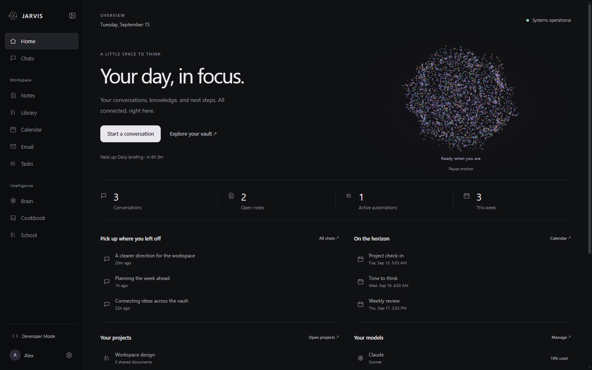
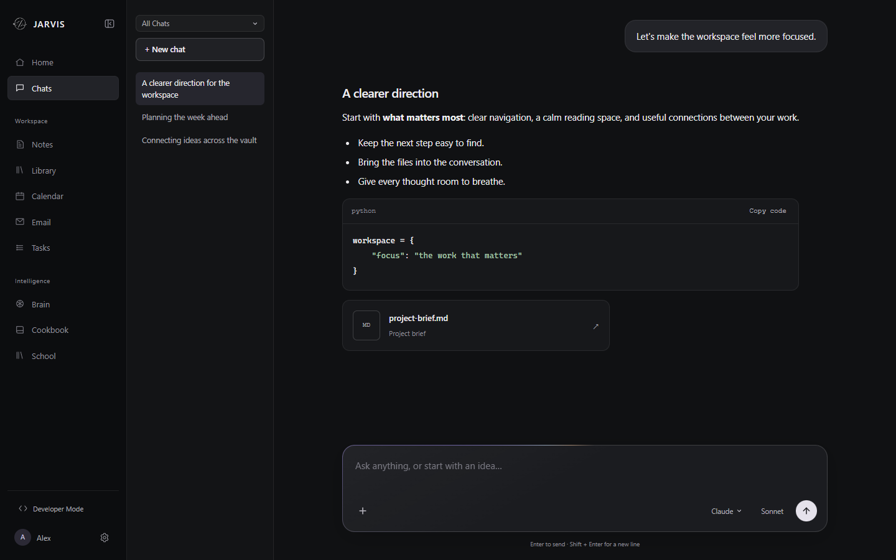
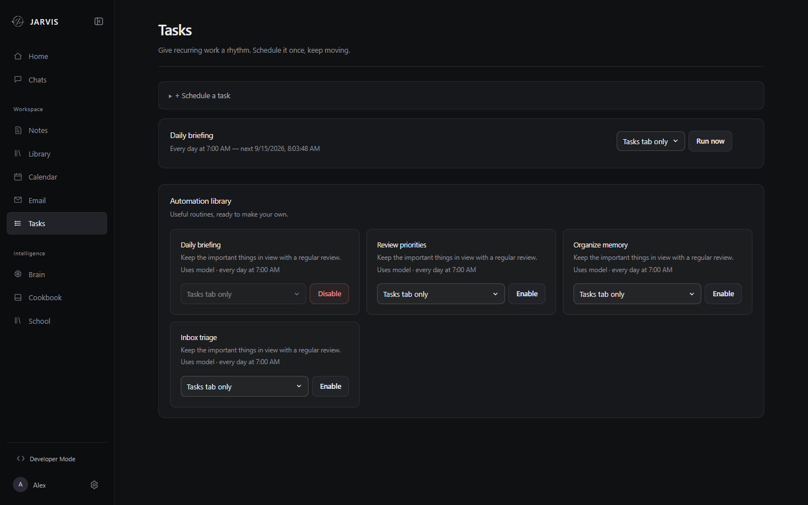
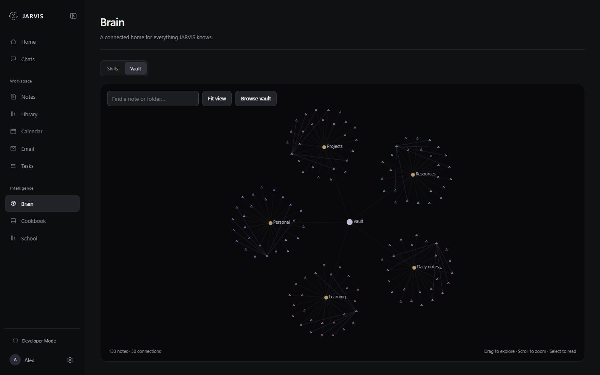
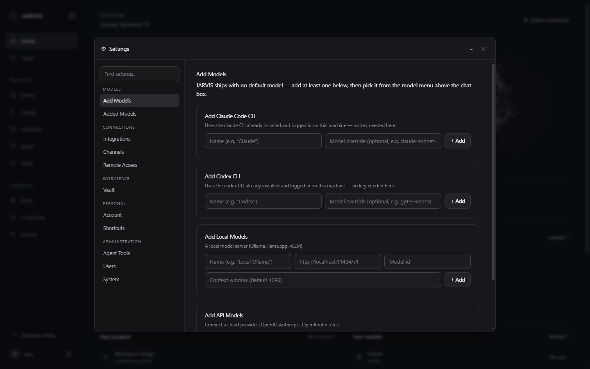

# JARVIS

An open-source, self-hosted AI workspace and agent harness. Everything runs on your own machine: your chats, notes, calendar, email, documents, and scheduled automations all live in local files you own, and you plug in whichever models you want.

This is the real product (v2). [jarvis-starter-kit](https://github.com/david-darr/jarvis-starter-kit) is the earlier clone-and-wizard v1, kept as a separate working reference.

**[Website](https://david-darr.github.io/jarvis-app/)** · **[Download the latest release](https://github.com/david-darr/jarvis-app/releases/latest)**



## What it does

- **Chat** with any model you connect — Claude via the Agent SDK, any OpenAI-compatible endpoint, or a local model (Ollama, or the built-in llama.cpp engine). Per-conversation model choice, file attachments, folder-scoped workspaces, and slash commands.
- **Mission Control home** — live system health, what's scheduled next, and a real activity feed of what the system has been doing.
- **Notes, Calendar, Email, Library** — one unified place for priorities and todos (due-dated notes render on the calendar), CalDAV/iCal calendar sync, IMAP/SMTP email accounts, and a searchable document library.
- **Tasks** — scheduled automations, either your own prompts or built-in ones (Daily Brief, tidy-up jobs, skill audits). Output can be delivered to a connected channel rather than just sitting in the tab.
- **Brain** — reusable `SKILL.md` procedures, plus a browsable graph of your Obsidian-style vault, which is where the assistant's long-term memory actually lives.
- **One memory, not two** — checkbox items in your vault's `Active Priorities.md` are synced into Notes on every launch, grouped by their vault headings, so asking about your priorities returns what's actually written in your vault. Ticking one in the app ticks it in the vault file too.
- **Channels** — reach the same assistant from Discord, with conversation state shared through the same sessions and vault.
- **Cookbook** — download and run local models without a separate install.
- **Remote access** — reach JARVIS from your phone or another computer over [Tailscale](https://tailscale.com), set up from Settings → Remote Access. Nothing is exposed to the public internet: the listener binds only to your Tailscale address, serves real HTTPS, and requires a login.

Memory is a folder of markdown notes, not a database — so it stays readable, portable, and editable by you or any other tool.

| | |
|---|---|
|  |  |
| **Chat** — per-conversation model choice, attachments, folder-scoped workspaces | **Tasks** — built-in and custom automations, delivered where you want them |
|  |  |
| **Brain** — your vault rendered as the linked graph it already is | **Models** — Claude, local servers, or any API provider |

## Install

| Platform | Download |
|---|---|
| Windows 10/11 | [`JARVIS-Setup.exe`](https://github.com/david-darr/jarvis-app/releases/latest) |
| macOS (Apple Silicon) | [`JARVIS-arm64.dmg`](https://github.com/david-darr/jarvis-app/releases/latest) |

Download it, run it, open JARVIS. **Nothing else needs to be installed** — a complete Python runtime with every dependency ships inside the app, so it works on a machine that has never had Python on it.

Neither build is code-signed yet. Windows SmartScreen will warn on first run (**More info → Run anyway**); macOS Gatekeeper will block it (right-click the app → **Open**, or allow it under System Settings → Privacy & Security). Intel Macs aren't supported yet — the macOS build is Apple Silicon only.

First launch walks you through onboarding: pick a vault folder and connect at least one model.

Your data lives in `%APPDATA%\JARVIS\data` (Windows), separate from the program files, so updating or reinstalling never touches your chats, notes, or credentials.

JARVIS updates itself: new versions download in the background and install when you quit, so an update never interrupts what you're doing.

## Developing

Requirements: **Python 3.12+** and **Node 18+**.

**Backend:**
```
pip install -r requirements.txt
uvicorn app:app --host 127.0.0.1 --port 8420
```
Then open http://127.0.0.1:8420 — or start the desktop shell, which spawns the backend for you:

**Desktop shell:**
```
cd electron
npm install
npm start
```

In dev the shell uses your `.venv`; a packaged build uses its own bundled runtime.

**Building the installer:**
```
cd electron
npm run dist
```
`predist` runs `scripts/build_runtime.py` first, which downloads an embeddable Python, installs `requirements.txt` into it, and verifies the result can import the app's dependency graph. That runtime (~400MB) is what gets bundled. Installed size is roughly 620MB.

> **Windows note:** building the NSIS installer requires **Developer Mode** enabled (Settings → System → For developers), or an elevated terminal. electron-builder's signing toolchain contains macOS symlinks, and Windows blocks symlink creation for non-elevated users without it. This only affects *building* the installer — the app itself and `win-unpacked/` build fine either way.

## Access and security

- By default (`AUTH_ENABLED=false`) the app runs as a single trusted local user with no login — the sane default for a desktop app on your own machine.
- Set `AUTH_ENABLED=true` to turn on real accounts: bcrypt password hashes, session cookies, optional TOTP 2FA, and an admin/non-admin split. **Use this for any setup reachable beyond localhost.**
- **Remote access** (Settings → Remote Access) binds only to your Tailscale interface address — never `0.0.0.0` — serves a real Tailscale-issued TLS certificate, and refuses to start unless a login exists. `scripts/run_remote.py` is the equivalent CLI path for development.
- TLS certificates are stored in your data directory, never in the app folder, so they can't end up in a backup or a distributed build.
- Credentials (email passwords, API keys, bot tokens) are encrypted at rest with a key generated per install. Everything sensitive lives in `data/`, which is git-ignored and excluded from packaged builds.

## Configuration

| Variable | Default | Purpose |
| --- | --- | --- |
| `AUTH_ENABLED` | `false` | Turn on real accounts + login |
| `APP_BIND` | `127.0.0.1` | Bind address |
| `APP_PORT` | `8420` | Port |
| `JARVIS_DATA_DIR` | in-repo `data/` | Where all runtime state is stored. The desktop app sets this to the per-user app-data location automatically. |
| `JARVIS_BACKEND_URL` | — | Point the Electron shell at an already-running backend instead of spawning one |

## Layout

```
app.py         FastAPI entry point — wiring only
core/          Brain, auth, sessions, scheduler, channels, event bus
routes/        HTTP API, one module per domain
services/      Domain logic — routes and agent tools are both thin adapters over this
static/        Frontend (no build step: plain ES modules + CSS)
mcp_servers/   Capability servers exposed to the agent
scripts/       Standalone CLI utilities
specs/         Living architecture docs
```

## Status

Actively developed and used daily. The desktop shell, all tabs, auth, scheduling, and channels work, and the packaged build is self-contained — verified by running it against an empty data directory on a clean interpreter.

macOS builds are produced on GitHub's macOS runners (`.github/workflows/build-macos.yml`), since a DMG can't be built from Windows.

Not yet done: neither build is code-signed, so Windows SmartScreen and macOS Gatekeeper both warn on first run. Intel Macs and Linux aren't built yet — the macOS runtime is fetched for the runner's own architecture, so shipping x86_64 needs a build matrix.

## License

MIT — see [LICENSE](LICENSE).
