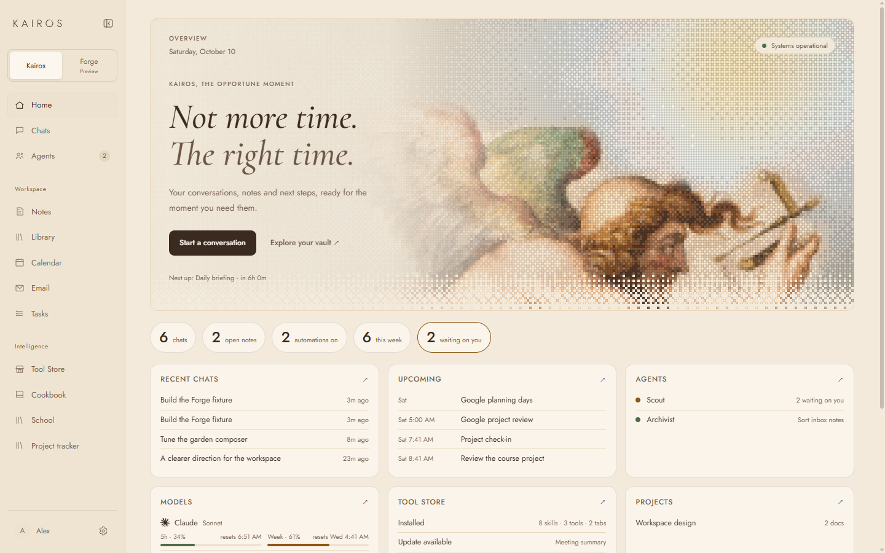
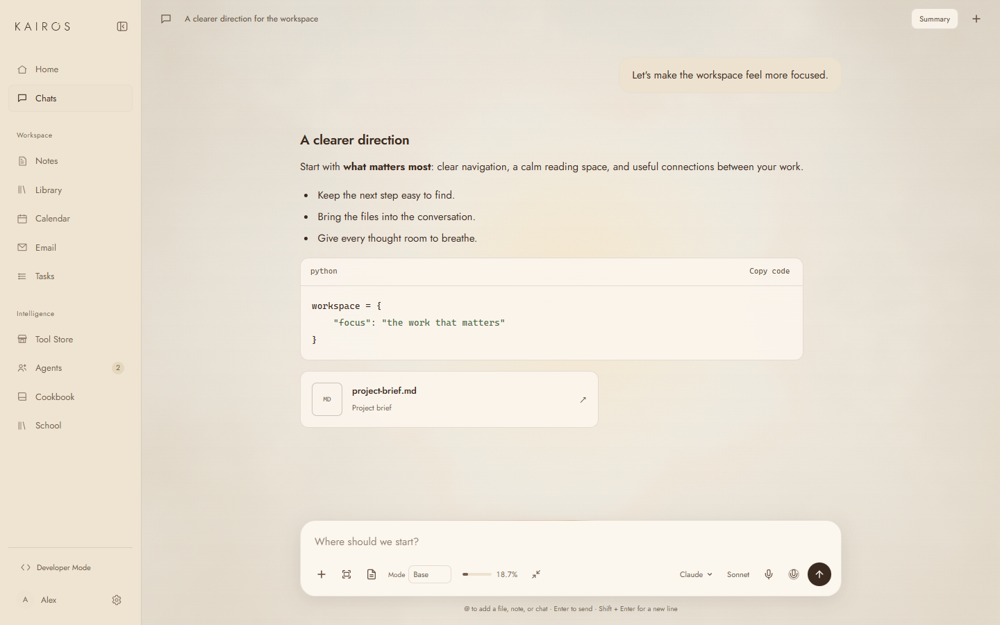
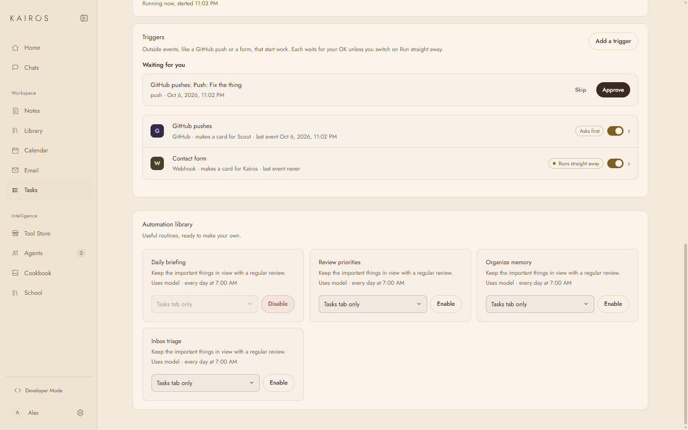
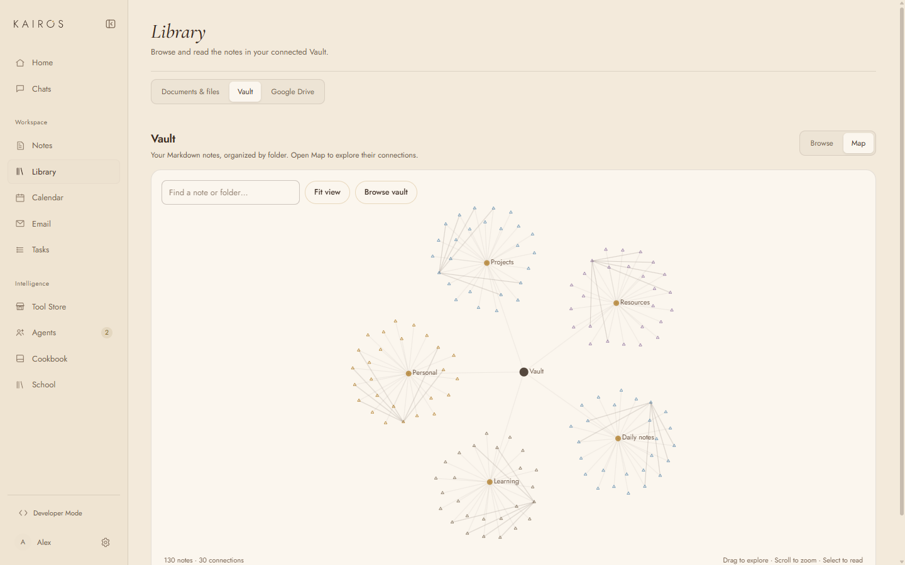
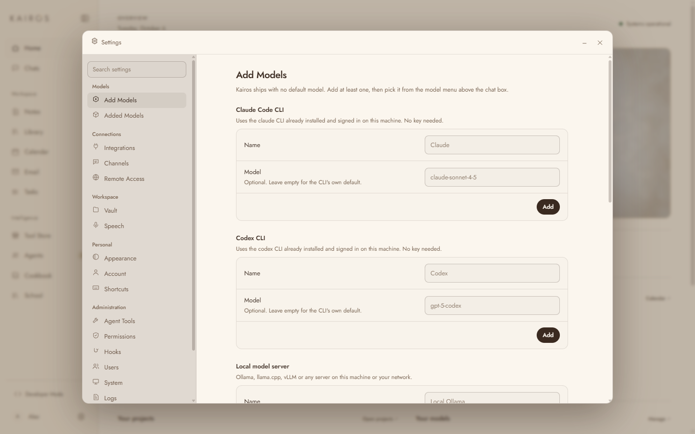
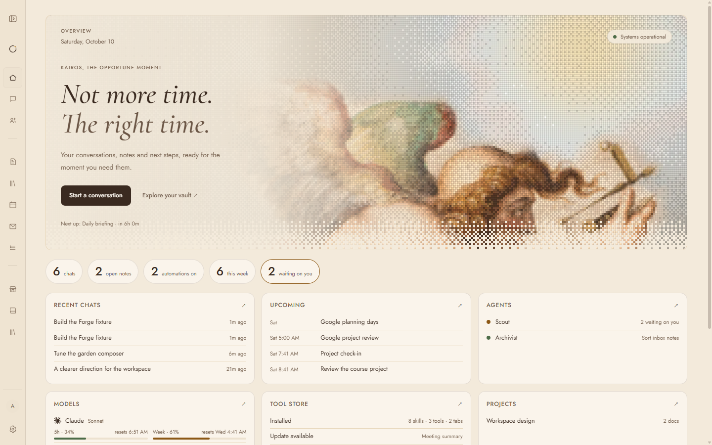
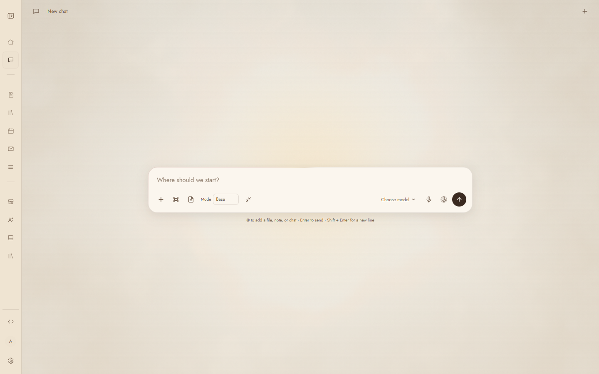

# Kairos

An open-source, self-hosted AI workspace and agent harness. Everything runs on your own machine: your chats, notes, calendar, email, documents, and scheduled automations all live in local files you own, and you plug in whichever models you want.

This is the real product (v2). [jarvis-starter-kit](https://github.com/david-darr/jarvis-starter-kit) is the earlier clone-and-wizard v1, kept as a separate working reference.

**[Website](https://david-darr.github.io/jarvis-app/)** · **[Download the latest release](https://github.com/david-darr/jarvis-app/releases/latest)**



*Development UI preview with sample data. The latest packaged release may differ.*

## What it does

- **Chat** with any model you connect — Claude via the Agent SDK, any OpenAI-compatible endpoint, or a local model (Ollama, or the built-in llama.cpp engine). Pick the model and its reasoning level per conversation from a searchable list of what your CLI actually offers, with an exact-ID box for anything unlisted, plus a context meter showing how full the current conversation is. File attachments, folder-scoped workspaces, and slash commands. Responses render as formatted Markdown with syntax-highlighted, copyable code; generated files show up as in-chat cards with previews for images, PDFs, Markdown, text/code, static HTML, and Office documents — spreadsheets as sheet tabs and a grid, documents as a reading view, slides one at a time, CSV as a table. Office files are read locally and never uploaded to a converter.
- **A side browser** in the chat, opened when you ask for it or when you follow a link in a reply. In the desktop app it runs as a real sandboxed browser view with its own cookies, separate from the app's, and it cannot reach Kairos's own backend. In a plain browser tab it falls back to an embedded frame, with open-in-new-tab always available for sites that refuse to be embedded.
- **Home dashboard**: recent conversations, projects, upcoming events, connected systems, and a live activity feed beside the Kairos mark and cloud-ring sky.
- **A focused workspace**: a centered new-chat composer that settles below the conversation, independently collapsible chat history, and a 52px icon rail. Layout preferences are remembered; mobile keeps full navigation and chat-history drawers.
- **Notes, Calendar, Email, Library** — one unified place for priorities and todos (due-dated notes render on the calendar), CalDAV/iCal calendar sync, IMAP/SMTP email accounts, documents and chat files. Library also lets you browse, search, read and edit Vault notes, with a Map for their links.
- **Tasks** — scheduled automations, either your own prompts or built-in ones (Daily Brief, tidy-up jobs, skill audits). Output can be delivered to a connected channel rather than just sitting in the tab.
- **Tool Store** — find and manage reusable `SKILL.md` procedures, install a public GitHub skill file, and browse or connect MCP tool servers.
- **One memory, not two** — checkbox items in your vault's `Active Priorities.md` are synced into Notes on every launch, grouped by their vault headings, so asking about your priorities returns what's actually written in your vault. Ticking one in the app ticks it in the vault file too.
- **Channels** — reach the same assistant from Discord, with conversation state shared through the same sessions and vault.
- **Cookbook** — download and run local models without a separate install.
- **Remote access** — reach Kairos from your phone or another computer over [Tailscale](https://tailscale.com), set up from Settings → Remote Access. Nothing is exposed to the public internet: the listener binds only to your Tailscale address, serves real HTTPS, and requires a login.

Memory is a folder of markdown notes, not a database — so it stays readable, portable, and editable by you or any other tool.

| | |
|---|---|
|  |  |
| **Chat** — per-conversation model choice, attachments, folder-scoped workspaces | **Tasks** — built-in and custom automations, delivered where you want them |
|  |  |
| **Library > Vault > Map** — your notes rendered as a linked graph | **Models** — Claude, local servers, or any API provider |

<details>
<summary>See the compact sidebar</summary>





*New-chat development preview with sample data. Chat history and app navigation collapse independently.*

The same workspace, with more room for your content. Demo data shown.

</details>

## Install

| Platform | Download |
|---|---|
| Windows 10/11 | `Kairos-Setup-<version>.exe` on the [latest release](https://github.com/david-darr/jarvis-app/releases/latest) |
| macOS (Apple Silicon) | `Kairos-<version>-arm64.dmg` on the [latest release](https://github.com/david-darr/jarvis-app/releases/latest) |

Download it, run it, open Kairos. **Nothing else needs to be installed** — a complete Python runtime with every dependency ships inside the app, so it works on a machine that has never had Python on it.

Neither build is code-signed yet. Windows SmartScreen will warn on first run (**More info → Run anyway**); macOS Gatekeeper will block it (right-click the app → **Open**, or allow it under System Settings → Privacy & Security). Intel Macs aren't supported yet — the macOS build is Apple Silicon only.

First launch walks you through onboarding: pick a vault folder and connect at least one model.

Your data stays in `%APPDATA%\JARVIS\data` (Windows), the existing JARVIS location. Kairos keeps that path so an upgrade retains your chats, notes, credentials, and encryption key.

Kairos updates itself: new versions download in the background and install when you quit, so an update never interrupts what you're doing.

## Developing

Requirements: **Python 3.12+** and **Node 22.12+** (Node 24 recommended). The development runtime is pinned to Electron 43.7.0; `npm install` in `electron/` downloads that runtime through the project's postinstall step.

**Backend:**
```
pip install --require-hashes -r requirements.lock
uvicorn app:app --host 127.0.0.1 --port 8420
```
`requirements.lock` pins every package, dependencies included, to an exact version and file hash, and is what the installer's bundled runtime is built from. To change a dependency, edit `requirements.txt` (every line needs an upper bound), regenerate the lock with the command in its header, and commit both.
Then open http://127.0.0.1:8420 — or start the desktop shell, which spawns the backend for you:

**Desktop shell:**
```
cd electron
npm install
npm start
```

In dev the shell uses your `.venv`; a packaged build uses its own bundled runtime.

`npm start` runs as the real app: it uses the same data folder (`%APPDATA%\JARVIS` on Windows), instance lock and port 8420 as an installed Kairos, so the two cannot run together and anything you try touches your real data.

**Development copy:** `npm run start:dev` starts "Kairos (dev)" beside the real app, with its own data folder (`%APPDATA%\JARVIS-dev`), port 8430, no auto-update and no global Quick Entry shortcut. The sidebar shows a DEV badge. Fill its data folder first:
```
python scripts/dev_instance.py fresh     # empty
python scripts/dev_instance.py copy      # a copy of your real data
python scripts/dev_instance.py status
```
`copy` switches off everything in the copy that would act by itself or reach back into the real app: scheduled tasks and Ready cards, Discord bots, remote access, Swarm schedules, and chats' links to Claude/Codex threads. It also copies the vault and points the copy at it. Model connections and signed-in accounts are copied as they are and are the real ones. An existing copy is moved aside with `--replace`, never deleted.

**Building the installer:**
```
cd electron
npm run dist
```
`predist` runs `scripts/build_runtime.py` first, which downloads an embeddable Python (checked against a pinned SHA-256), installs `requirements.lock` into it with `--require-hashes`, and verifies the result can import the app's dependency graph. That runtime (~400MB) is what gets bundled. Installed size is roughly 620MB.

> **Windows note:** building the NSIS installer requires **Developer Mode** enabled (Settings → System → For developers), or an elevated terminal. electron-builder's signing toolchain contains macOS symlinks, and Windows blocks symlink creation for non-elevated users without it. This only affects *building* the installer — the app itself and `win-unpacked/` build fine either way.

## Access and security

- By default (`AUTH_ENABLED=false`) the app runs as a single trusted local user with no login — the sane default for a desktop app on your own machine.
- Set `AUTH_ENABLED=true` to turn on real accounts: bcrypt password hashes, session cookies, optional TOTP 2FA, and an admin/non-admin split. **Use this for any setup reachable beyond localhost.**
- **Remote access** (Settings → Remote Access) binds only to your Tailscale interface address — never `0.0.0.0` — serves a real Tailscale-issued TLS certificate, and refuses to start unless a login exists. `scripts/run_remote.py` is the equivalent CLI path for development.
- TLS certificates are stored in your data directory, never in the app folder, so they can't end up in a backup or a distributed build.
- Credentials (email passwords, API keys, bot tokens) are encrypted at rest with a key generated per install. Everything sensitive lives in `data/`, which is git-ignored and excluded from packaged builds.

## Configuration

| Variable | Default | Purpose |
| --- | --- | --- |
| `AUTH_ENABLED` | `false` | Turn on real accounts + login |
| `APP_PORT` | `8420` | Fallback address for helper processes (Codex's write tools) before the backend has seen a local request. The server's own port comes from its launch command (`--port`). |
| `JARVIS_DATA_DIR` | in-repo `data/` | Where all runtime state is stored. The desktop app sets this to the per-user app-data location automatically. |
| `JARVIS_BACKEND_URL` | — | Point the Electron shell at an already-running backend instead of spawning one |

## Layout

```
app.py         FastAPI entry point — wiring only
core/          Brain, auth, sessions, scheduler, channels, event bus
routes/        HTTP API, one module per domain
services/      Domain logic — routes and agent tools are both thin adapters over this
static/        Frontend (no build step: plain ES modules + CSS)
mcp_servers/   Capability servers exposed to the agent
scripts/       Standalone CLI utilities
specs/         Living architecture docs
```

## Status

Actively developed and used daily. The desktop shell, all tabs, auth, scheduling, and channels work, and the packaged build is self-contained — verified by running it against an empty data directory on a clean interpreter.

macOS builds are produced on GitHub's macOS runners (`.github/workflows/build-macos.yml`), since a DMG can't be built from Windows.

Not yet done: neither build is code-signed, so Windows SmartScreen and macOS Gatekeeper both warn on first run. Intel Macs and Linux aren't built yet — the macOS runtime is fetched for the runner's own architecture, so shipping x86_64 needs a build matrix.

## License

MIT — see [LICENSE](LICENSE).
